<!-- _class: hero -->

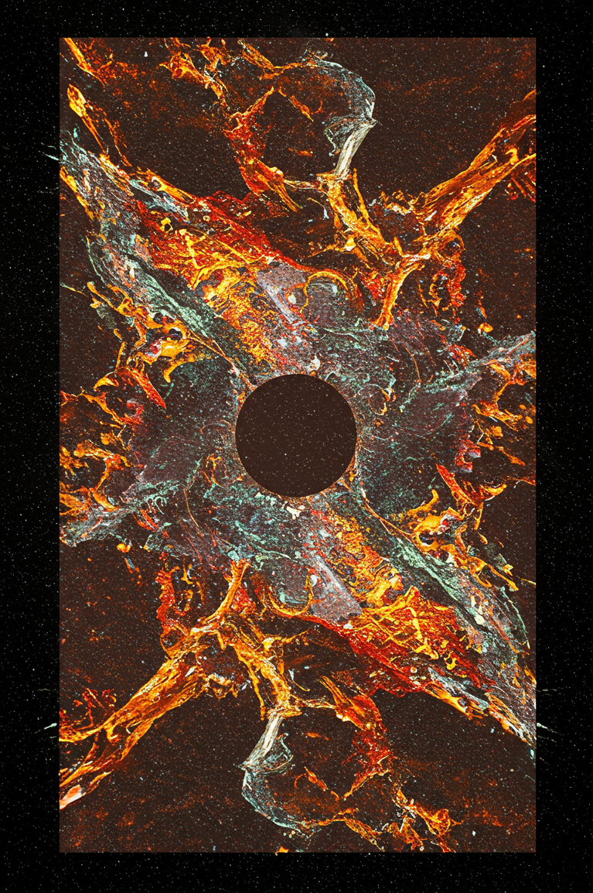

# Remixing for Democratic Collective Intelligence

## Design and Implementation of a Scalable Platform

 

**Yanick Bachmann**
Chair of Computational Social Science · ETH Zürich
*Supervisors:* Prof. Dr. Dirk Helbing, Dr. Dino Carpentras

<!--
Speaker Notes:
Thank you for having me. I'll walk you through Synesis — a platform I built for scalable democratic decision-making based on "remixing." I'll explain the system, show what happened when real communities used it, present simulation results on how it scales, and discuss what needs to change next.
-->

---

# Problem Setting

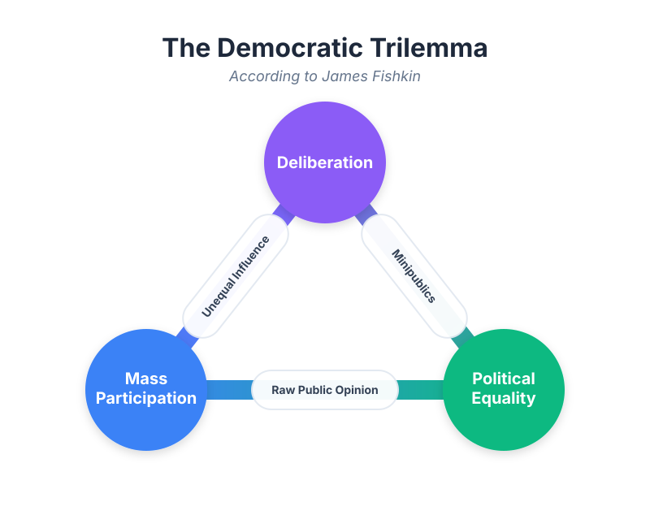

- **Deliberation:** Quality interaction, but limited to ~5–30 people
- **Delegation:** Scales, but narrows participation to representatives
- **Crowdsourcing:** Mass participation, but institution retains authority

<!--
Speaker Notes:
Quick framing. Fishkin formalizes what we know intuitively: deliberation works but doesn't scale. Delegation scales but concentrates power. Crowdsourcing opens participation but the institution keeps decision authority.

-->
---

# Synesis: Pushing the Limits of Democratic Participation

**Remixing:** Asynchronous building-upon — iterative, direct authority, scalable

From Greek *s'ynesis* ("bringing together," "understanding"): the capacity to connect scattered pieces of information into a coherent whole. The platform's core mechanism: synthesizing distributed contributions into collective outcomes.

<!--
Speaker Notes:
Remixing claims to break out of this zero-sum by replacing synchronous discussion with asynchronous building-upon. It occupies a previously empty region of the design space — sustaining intensive interaction at mass scale while distributing authority equally. The question is whether it works.
-->

---

# Shared Knowledge Base: The DAG

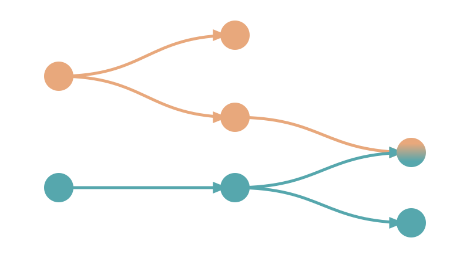

<!-- 
- **Shared knowledge base → fairer outcomes:**
  Carpentras et al. (2024) show that storing partial solutions → both majority *and* minority solutions improve -->
- **Ideas = Nodes, Evolutions = Directed Edges** → a Directed Acyclic Graph
- **Non-destructive:** Parent and child coexist ("Git for deliberation")

---

# Phases
<!--  -->

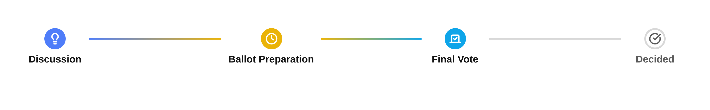
**Discussion:** _continuous, asynchronous_:  creation and evaluation happen simultaneously, 
fitting people's real schedules. 

**Full voting Phase:** The final candiates must be presented to all

<!--
Speaker Notes:
To operationalize this collective brain, Synesis organizes proposals into a Directed Acyclic Graph. You have root proposals, single-parent edits, and multi-parent combinations — merges. Crucially, iteration is non-destructive: the parent and child coexist, and the community's signals determine which variant rises.

I implemented a Constrained Interaction Model: no comments, no downvotes. If you disagree, your only option is a constructive alternative. As we'll see, this had massive behavioral consequences.

A key difference from Dino's simulation: his ABM uses strict synchronized rounds — all agents propose, then all vote. That's impractical with real humans across multiple days. So Synesis uses a continuous asynchronous model where people contribute whenever they have time. But this means the system itself must handle attention routing — otherwise early proposals get all the attention and late ones are invisible.
-->

---

# The Attention Problem

With simultaneous adding and voting in an asynchronous system:

- **First-mover advantage:** Early proposals accumulate views and subscriptions before alternatives exist
- **Information overload:** $N$ participants × $P$ proposals = quadratic attention matrix — nobody can read everything
- **Discovery failure:** Good ideas buried under volume

<strong>The system must guide users:</strong> counteract first-mover effects, aid discovery of under-explored ideas, and sift out the best branches in the DAG so people can work on those.

<!--
Speaker Notes:
This is the core engineering challenge that doesn't exist in Dino's simulation, where agents have global visibility. In reality, when 50 or 400 people contribute to a shared knowledge base asynchronously, you get a quadratic attention problem. The platform has to distribute the evaluation workload so each proposal gets enough assessments, while each user only reads a tractable subset. And it has to do this without creating filter bubbles or reinforcing first-mover advantages.

This is where the Three-Window Architecture comes in.
-->

---

# Windows: Collective vs. Personal

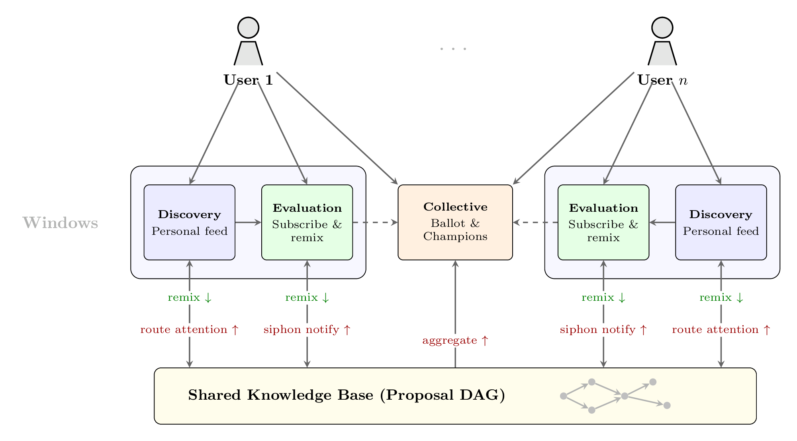

The DAG can be viewed from two perspectives, in productive tension:

**Collective:** 
*"What are the best ideas?"*
**Personal:** 
*"Where can I contribute?"*

<!--
Speaker Notes:
A system optimized purely for personal relevance risks filter bubbles. A system optimized purely for collective popularity suppresses novel ideas. The Three-Window Architecture mediates this tension.

The Discovery Window uses an algorithm called PersonalFocus to route each user's attention. The Evaluation Window is where users maintain persistent subscriptions — a binary signal that means both "I'm interested" and "I endorse this." And the Collective Window surfaces the most supported proposals to drive convergence toward a decision.

Critically, the Evaluation Window is structurally independent from Discovery. Users can find proposals through any channel — the Collective Window, direct links, browsing — and subscribe. The convergence mechanism works regardless of how users discover proposals.
-->

---

# Mechanisms: PersonalFocus & Siphon Effect

### Instance of Discovery Window
**PersonalFocus Algorithm**
- **Anti-preferential attachment:** each view *reduces* future visibility → no rich-get-richer
- **Novelty premium, diversity boost, personal affinity**
- **Under-explored ideas** surface automatically

### Instance of Evaluation Window
**Subscriptions & Siphon Effect**
- **Siphon Effect:** When a proposal is remixed, its subscribers get notified
- If they prefer the remix, they move their subscription
- **Support flows "down" the DAG** to better versions

<!--
Speaker Notes:
Two key mechanisms. PersonalFocus implements anti-preferential attachment: every time someone views a proposal, its future visibility score drops. This is the opposite of typical social media platforms where popular content gets more attention. Here, under-explored proposals are systematically surfaced.

The Siphon Effect drives convergence. When someone remixes a proposal, all subscribers of the parent are notified. If they like the remix better, they move their subscription. Support literally flows downstream through the DAG to the most refined versions.

The ballot on the right shows why label-exclusive selection matters: the Even Distribution ballot maintains full 7-out-of-7 label coverage at all scales, while a naive top-7-by-subscriptions ballot loses thematic diversity. Though as we'll see, this comes at a quality cost.
-->

---

# Convergence: Labels & Ballot Diversity

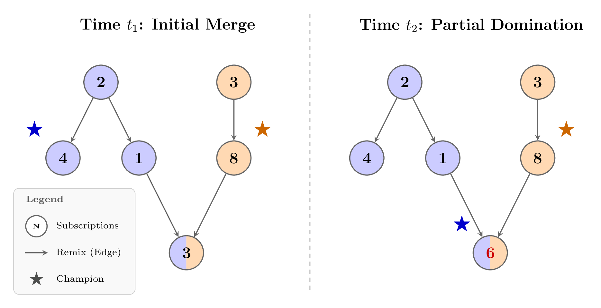

- **User-generated labels** categorize proposals thematically 
- Labels **inherit through the DAG:** edits keep parent's label, combinations inherit the **union** of both parents' labels

- **Label-Exclusive Ballot:** up to 7 Champions, no label overlap → guarantees structural diversity 

<!--
Speaker Notes:
The convergence mechanism uses labels to ensure the final ballot represents diverse thematic strands, not just the most popular ideas. Each proposal carries labels — assigned by the author at root creation and inherited deterministically through edits and combinations. The champion per label is the most-subscribed proposal carrying that label.

The ballot algorithm iteratively selects champions with zero label overlap, up to 7 slots. This guarantees that the final vote covers distinct perspectives. Without label exclusion, popular labels dominate and crowd out minority perspectives. With it, you get full thematic coverage even as the DAG grows. However, as we'll see in the simulation results, this hard exclusion rule has a quality cost at scale.
-->

---

# Value-Sensitive Design Choices

- **Labels: parallel, unintrusive discussion + diversity-preserving aggregation**
  Thematic branches evolve independently; the ballot algorithm ensures minority perspectives reach the final vote without requiring moderation

- **PersonalFocus: balancing group vs. individual attention**
  Anti-preferential attachment distributes collective exploration fairly, while personal affinity respects individual interests
  
- **AI-agnostic design**
  Modular Design. Prototype: Simple heuristics over opaque algorithms. no black-box ML models. -> Procedural Legitimacy
<!-- 
- **Privacy-first computation:**
  PersonalFocus runs **entirely client-side**  -->

<!--
Speaker Notes:
These are the five most consequential design decisions in the system. The label system enables parallel unintrusive discussion — different thematic strands evolve independently without interfering with each other, and the ballot algorithm ensures this diversity is preserved in the final vote. PersonalFocus balances the tension between what the group needs evaluated and what each individual finds interesting. The AI-agnostic principle is deliberate: every ranking, every champion election, every ballot composition is traceable to explicit user actions and documented formulas. We tested automated clustering and rejected it because users found it opaque and unpredictable. The PersonalFocus algorithm runs entirely client-side — the server never learns which proposals the algorithm prioritized for a user, only which ones they chose to interact with. And the positive-only constraint forces constructive engagement, though as we'll see, this came at a cost.
-->

---
<!-- 

# Questions about how the system works?

<!--
Speaker Notes:
Before I move on to evaluation — any questions about the architecture, the mechanisms, the design choices?

--- -->

<!-- _class: hero -->
# Evaluation: Two Approaches

### 🧑‍🤝‍🧑 User Study
- 2 community deployments (N=11, N=12)
- Community defined normative questions
- Mixed methods: telemetry, SUS survey, think-aloud

### 🤖 Simulation Testbed
- 90 runs, 30-day window
- Agents use **actual platform API**
- Scales to N=400
- Empirically calibrated from human data

<!--
Speaker Notes:
I tested the platform in two ways. First, two real-world deployments with community housing networks in the Zurich area, working on real normative questions in German. Second, a 90-run simulation testbed where agents interact with the identical server API that humans use — not an abstract simulation, but the real platform backend. Agent behavior was calibrated from Study 1 telemetry data.
-->

---

# User Study: Setting

### Study 1: WG Studiengruppe
- **11 participants**, 12 days
- 1 question: *fair cost-sharing for shared purchases*
- Pre-existing flat-sharing community

### Study 2: WG-Netz Winterthur
- **12 participants**, 19 days
- 2 questions: *network identity* + *resource sharing*
- Pre-existing community network

 

Both: real communities, real normative questions, German-language, 50–64% mobile access.
**Mixed methods:** platform telemetry · usability survey

<!--
Speaker Notes:
Study 1 was a flat-sharing community of 11 people working on how to fairly distribute costs for shared household purchases. Study 2 was a network of housing cooperatives in Winterthur with 12 participants, working on two concurrent questions: defining the network's identity and designing a resource-sharing system.

Both were real communities with real stakes — these weren't hypothetical exercises. The questions were selected collaboratively with the community leaders.
-->

---

# Study Results: Emerging DAG Structures

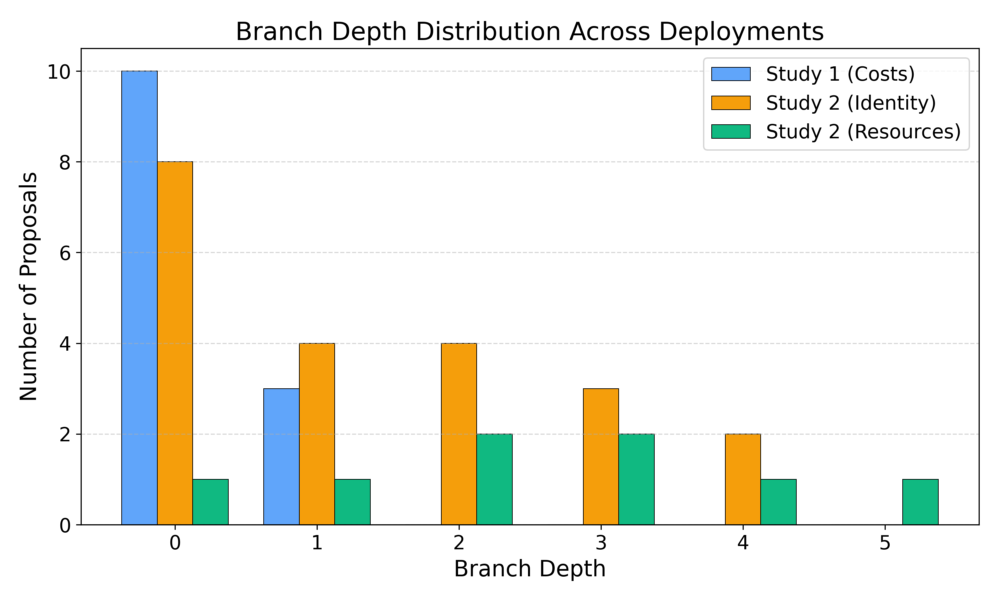

Three distinct regimes emerged:

- 🔴 **Flat Failure** (Study 1): Depth 1, 23% remix rate, 10 independent roots — virtually no building-upon
- 🟢 **Deep Refinement** (S2-Q1): Depth 5, 87.5% remix, single iterative chain over 10 days
- 🟡 **Balanced Synthesis** (S2-Q2): Depth 4, 62% remix, 6 multi-parent merges bridging thematic clusters

<!--
Speaker Notes:
The telemetry revealed three completely different topological regimes. Study 1 was a flat failure — participants refused to remix and instead generated 10 independent root proposals. Study 2's identity question showed beautiful deep refinement: one root iteratively improved over 10 days to depth 5. The resource-sharing question showed balanced cross-pollination with 6 multi-parent merges.
--->

---
# Study Results: Survey

**On remixing difficulty:**
- *"I wanted to comment on others' ideas rather than rewrite them, which I could not do"*
- *"It was difficult when multiple ideas were being discussed simultaneously"*
- *"With more participants it becomes increasingly difficult to reunite the common consensus when time is limited"*

**On cognitive load & orientation:**
- *"The most difficult thing was to orient oneself"*
- SUS scores: **57.5** (S1) / **51.7** (S2) — both well below the 68 benchmark

**On fairness & participation barriers:**
- *"It favors motivated and engaged people with technical flair. You need to invest a certain start-up energy and return often to stay in the discussion"*

<!--
Speaker Notes:
The survey paints a consistent picture. The core friction is cognitive: reading, understanding, and then reformulating someone else's idea as a constructive alternative is extremely demanding. Participants who just wanted to leave a quick reaction had no lightweight way to do so.

The SUS scores — 57.5 and 51.7 — place the platform firmly in the "marginal" usability range. The 95-98% passive navigation figure means that for every subscribe or remix action, users performed roughly 20-25 page views and tab switches. That's the real cost of brain-to-brain communication through text.

The fairness quotes are particularly telling: the platform grants formal equality — everyone has the same Edit button — but the cognitive investment required to participate meaningfully creates substantive inequality. This maps directly onto the Value-Sensitive Design discussion later.
-->
<!-- 
---

# Human Results: Labels, Ballot, and Lessons

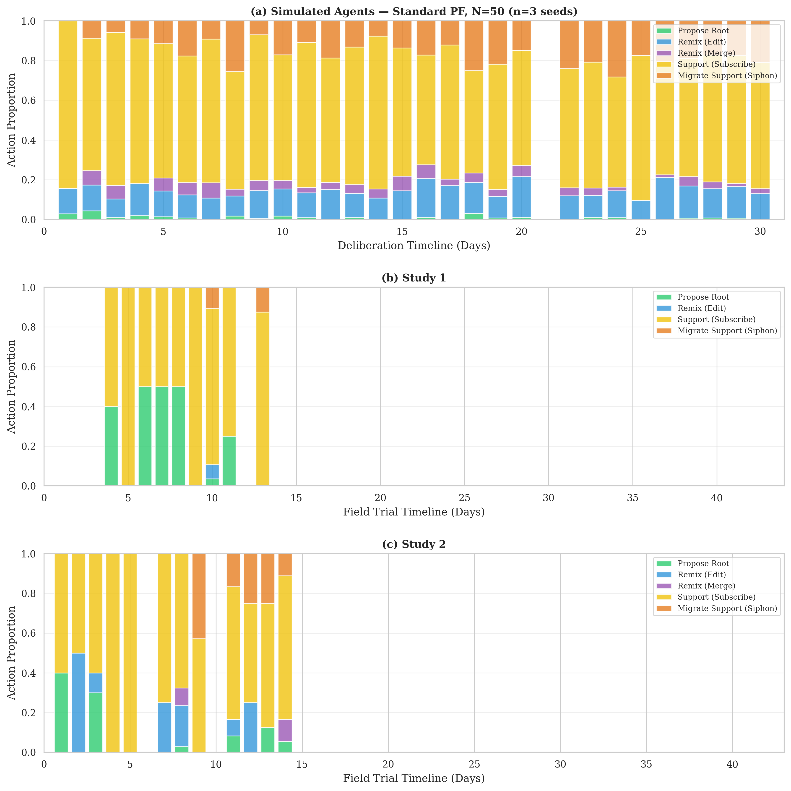

- **Labeling system:** Few users understood it. Labels propagate rigidly through the DAG — can't adapt when ideas evolve semantically.

- **Participation in later phases collapsed (Ballot voting):**
   **27%** (S1) → **17%** (S2)

<!--
Speaker Notes:
The labeling system was not intuitive. Labels assigned at root creation propagate through the entire DAG lineage, and users couldn't reassign them when ideas evolved semantically. One participant noted that with few participants, there were too few remixes to generate meaningful label diversity.

The ballot participation drop-off was dramatic: from 57% in the pilot — where we had office proximity and in-person nudging — down to 17% in Study 2. In the formative evaluation, the ballot section was literally never visited unless the observer prompted the participant. The action dynamics on the right show the contrast: simulated agents maintain balanced action proportions throughout, while human activity dies off quickly and is dominated by passive navigation.

 -->
---

# ABM Simulation: Setup

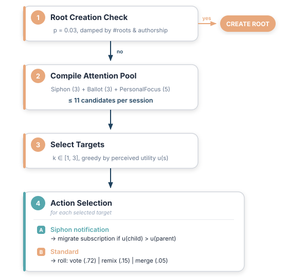

- Agents interact via the **actual platform API**
- **Quality Model:** $u_i(s) = q(s) + \varepsilon_i(s)$
  Remixing perturbs latent quality $q$
- **Asynchronous:** 30-day, Poisson sessions
- **90 runs** across 3 suites (N=10→400)
<!-- three-window ablation, siphon ablation -->

<!--
Speaker Notes:
Quick note on the simulation setup. This is not a separate theoretical model — agents interact with the identical server API that humans used. The only difference is that the PersonalFocus scoring is mirrored locally for performance. Agents have bounded attention: they see at most 11 proposals per session, compiled from three interface windows. This is the key difference from Carpentras's model, which assumes agents evaluate proposals from global or uniform random samples. Our agents were empirically calibrated from Study 1 telemetry — things like the power-user distribution, proposals per agent, subscription retraction rate. We ran 90 simulations across three suites testing different aspects of the system.
-->

---

# Simulation Results

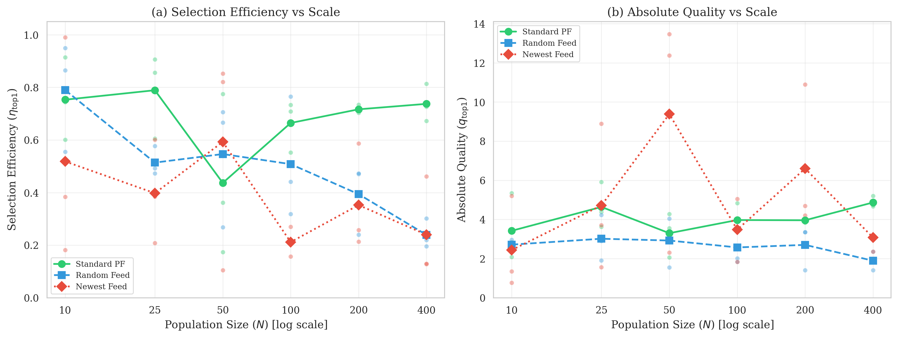

- **Selection efficiency stays high:** PersonalFocus maintains $\eta > 0.70$ at N=400

- **Absolute quality has slight upward trend**:
  Label-exclusive ballot might be too restrictive. 

<!--
Speaker Notes:
The good news: the selection machinery scales. PersonalFocus maintains selection efficiency above 0.70 even at 400 agents, while random and newest-first feeds collapse. The green line on panel (a) shows this clearly.

However, the label-exclusive ballot actually decreases winner quality at scale. At N=100, the unconstrained variant finds a higher-quality winner because the hard label-exclusion rule blocks top-quality proposals that happen to share labels with already-selected ballot candidates. This is a direct consequence of multi-parent remixes inheriting the union of all parent labels — deep proposals accumulate many labels and get cascadingly excluded.

The key takeaway from ablation: intelligent feed routing is the primary engine of quality. Ballot diversity provides a smaller, and at scale negative, contribution.
-->

---

# Humans vs. Simulation

<!-- 
| Dimension | ABM | Human |
|-----------|-----|-------|
| **Remix Rate** | 100% | 23–69% |
| **Actions/User** | 13.2 | 5.3–6.1 |
| **Signal** | Pure endorsement | Endorsement + bookmarking |
| **Temporal** | Uniform turns | Deadline bursts | -->

Agents do **2.4× more actions**, **4× more remixes**, and **1.9× more subscriptions** than humans.

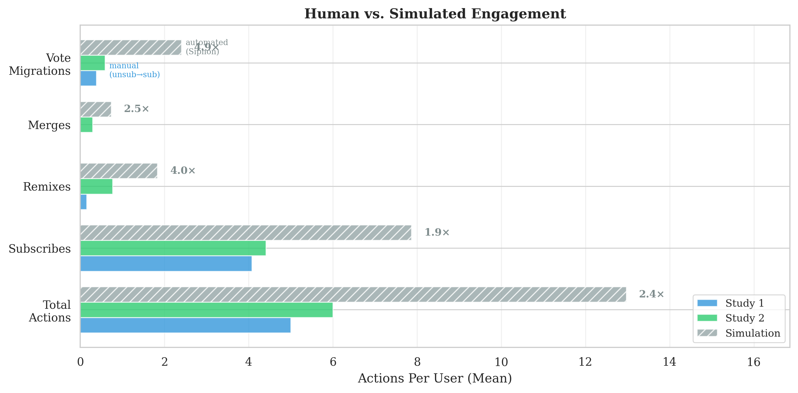
<!--
Speaker Notes:
The bar chart quantifies this gap directly. The simulation assumes agents that always remix when they find something improvable, that evaluate systematically, and that act in uniform turns. Humans don't do any of this.

They use subscriptions as bookmarks, muddying the convergence signal. They procrastinate and act in deadline-driven bursts. And their evaluation capacity is strictly capped by human reading speed — about 6 proposals per session. This gap is the central empirical finding: it tells us exactly where the system needs to improve.
-->

---

<!-- _class: hero -->

# Algorithm Scales - Human Interface Has Potential

### Algorithmic Coordination
## **Scales ✓**
Algorithms route attention and aggregate signals effectively
$\eta > 0.70$ at N=400

### Human Generation
## **Bottlenecked ✗**
Checking changes and merging proposals is hard cognitive labour.

The selection machinery works. The generative machinery is bottlenecked by the cognitive friction of text communication communication.

<!--
Speaker Notes:
If we zoom out, the central finding is a fundamental asymmetry. The algorithms work — PersonalFocus distributes attention, the Siphon Effect drives convergence, selection efficiency holds at scale. But the human side — reading, comprehending, and synthesizing complex text proposals — costs too much time and social energy to scale naively. The simulation proves the architecture is sound; the human studies show where the friction lives.
-->

---

# Improvements for Next Iteration

- 📹 **Better (video) explanation of the system**
  Most consistent user request across all studies. Terminology & Complexity was a major barrier.

- 💬 **Option to comment** — and potentially transform comments and questions into remixes
  Bridging lightweight feedback with generative building-upon.

- 🧹 **Reduce system complexity further:**
  Label system might be ditched → simpler **DAG-lineage exclusivity** based on structural connection strength (via votes, subscriptions, even past subscriptions)

- 📱 **Native app with push notifications**
  Better engagement than web-only. In-app notifications worked (56% response rate in Study 2), but a dedicated app would lower the entry barrier.

<!--
Speaker Notes:
Four concrete things for the next iteration. First, video onboarding — this was the single most requested improvement. Participants struggled with terminology and never discovered the ballot section without prompting.

Second, re-introducing comments. The current system forces you to write a full proposal to participate. If we allow comments and then offer a pathway to transform good comments into remixes, we keep the generative dynamics while lowering the entry barrier.

Third, the label system needs rethinking. The rigid label propagation caused problems at every level — semantic drift, cascading ballot exclusion, user confusion. A simpler approach based purely on structural DAG lineage — how strongly connected parts of the graph are via votes and subscriptions — could replace the label system entirely.

Fourth, a proper app. The web interface worked, and in-app notifications had a 56% response rate in Study 2. But a native app with push notifications would dramatically lower the "return to platform" friction.
-->

---

# Perspective

**Multimodal remixing:**
Voice, drawings, video as input modalities → lower barriers for non-writers. Cross-modal translators could convert spoken or visual contributions into the text and vice versa.

**Actually _Democratic_ Collective Intelligence:**
Potenial for replacing undemocratic collective intelligence systems.

* E.G. replacing chaotic and unfair resource allocation systems like markets with 
**fine-grained democratic economic planning:** 
  * The historical bottleneck was informational (Cockshott & Cottrell), not computational. 
-> Synesis promises st exactly that.

<!--
Speaker Notes:
Two directions. First, multimodal remixing. The current platform is text-only, which creates a literacy barrier. Extending input to voice, drawings, or video would open participation to people less comfortable with written text.

Second, the bigger vision. If collective decisions can be made quickly and at scale, the most consequential application isn't civic town halls — it's economic coordination. Markets are capitalism's default instantiation of collective intelligence, but they're chaotic and undemocratic. Cockshott and Cottrell argued in 1993 that computerized planning is technically feasible — the obstacle is political. Beer's Cybersyn in Chile proved cybernetic economic coordination could work before it was destroyed by the 1973 coup, not by technical failure. What these models lacked was an upstream deliberative layer: problem definition, proposal generation, iterative refinement, convergence. That's exactly what Synesis provides.
-->

---

<!-- _class: hero -->

# Conclusion

*"Although bottlenecked by the cognitive friction of communication, the DAG architecture provides the structural foundation to scale democratic collective intelligence."*

*"Lowering these transmission barriers could unlock mass participation, extending democratic control into traditionally undemocratic domains."*

 

**Thank you.**
Questions & Discussion

<!--
Speaker Notes:
To conclude: Synesis proves that non-destructive iteration can be operationalized for normative human decisions. The structure works. The algorithms work. The next frontier is lowering the transmission barriers between human minds. Technology can make the structural conditions of collective decision-making transparent. It cannot resolve them. Thank you, and I'm looking forward to your questions.
-->
